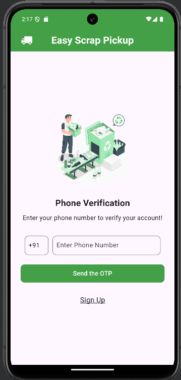
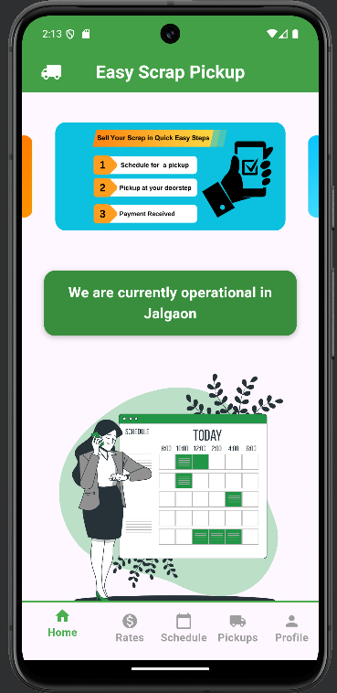

# 🚛 **Easy Scrap Pickup**  
**An Android application to schedule scrap pickup services efficiently.**

---

## 📌 **Project Overview**  

**Easy Scrap Pickup** is an intuitive mobile application built using **Flutter & Firebase**. It allows users to schedule scrap pickups conveniently, with real-time tracking and a seamless admin dashboard to monitor and manage operations.  

This app promotes efficient waste management by bridging the gap between users and scrap pickup services.

---

## 🛠️ **Tech Stack**

- **Frontend**:  
  - [Flutter](https://flutter.dev/) (Dart) - For cross-platform mobile development.  
- **Backend**:  
  - [Firebase Firestore](https://firebase.google.com/) - Real-time database for data storage and retrieval.  
  - [Firebase Authentication](https://firebase.google.com/docs/auth) - Secure login/signup system.  
- **Development Environment**:  
  - Android Studio / VS Code  

---

## ✨ **Features**

### 📱 **User Side Features**
- **Sign Up & Login**: Secure user authentication with Firebase.  
- **Home Screen**: View scrap rates and announcements.  
- **Schedule a Pickup**: Book a scrap pickup at a specific date and time.  
- **Track Scrap Pickup Status**: View real-time updates about scheduled pickups.  
- **Profile Management**: Edit user information easily.

### 🖥️ **Admin Side Features**
- **Admin Dashboard**: Monitor and manage scrap pickup requests.  
- **Rate Management**: Admin can set scrap rates dynamically.  
- **Pickup Status Management**: Update the status of scrap pickups (Scheduled → Completed).  
- **Admin Profile**: Manage and view admin account information.

---

## 💬 **Screenshots**

### 📱 User Side
<table>
  <tr>
    <td></td>
    <td></td>
    <td></td>
  </tr>
  <tr>
    <td align="center">Login Screen</td>
    <td align="center">Home Screen</td>
    <td align="center">Pickup Scheduling</td>
  </tr>
</table>

---

### 🖥️ Admin Side
1. **Admin Dashboard**  
   
---

## ⚙️ **Setup Instructions**

### 1. **Clone the repository**
```bash
git clone https://github.com/<your-username>/<repo-name>.git
